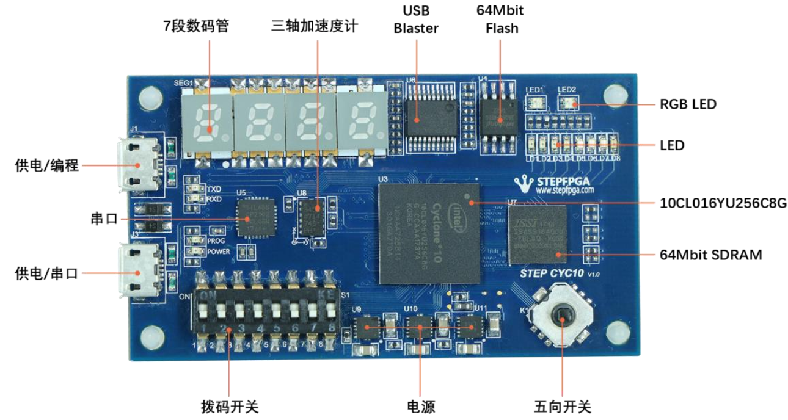

# 硬件文档综述
本文档是2018年-2019年春季学期操作系统大作业（第2组：轻量OS在“小脚丫”FPGA开发板上的实现）的硬件部分设计文档，项目的整体目标为在小脚丫FPGA上实现一个略加修改的[迷你CPU](http://recc.robertelder.org)，并在这样一块迷你CPU上运行一个[轻量级的操作系统](https://github.com/RobertElderSoftware/recc)。

为了完成这样一个整体目标，硬件部分必须实现及完成的功能有：
1. 支持预先定义的19条指令。
2. 支持中断处理。
3. 在硬件上实现一个可以将程序（操作系统）导入储存单元的BootLoader。


# 开发环境及硬件简介
## 小脚丫FPGA
本项目最终使用的硬件开发板为STEP-CYC10 v1.0，开发板上包含的硬件资源有：
* Intel Cyclone10 LP 10CL016YU256C8G 的FPGA一块，共包含16000个逻辑单元以及504Kbits的板上储存空间。
* 12M晶振与50M晶振。
* 4位7段数码管。
* 8个用户LED。
* 2个三色RGB LED。
* 1路五项开关以及8路拨码开关。

除此之外，按照开发板的设计图所示，板上还应当有64Mbit SDRAM以及64Mbit QSPI FLASH。但是由于当前手上的资料为未公开版本，相关使用文档说明不充分，且为了保证在更小的FPGA开发板上的兼容性，我们没有使用这部分资源。




## 开发软件
开发使用Quartus 17.1 Lite版本进行，利用USB Blaster将程序烧录至开发板，并通过串口通讯工具进行开发板与计算机的通信。


# 指令运行过程设计
## 综述
考虑到硬件资源的限制以及该指令系统的中断处理机制，我们并没有实现指令流水线，而是采用了多周期的CPU，每一个指令的执行通过以下五个周期（阶段）完成：
* IF取指阶段：从PC寄存器指向的地址获取这条指令。
* ID译码阶段：对指令进行解释，判断指令类型，访问寄存器，获取立即数并填充到32位，检测跳转指令。
* EX执行阶段：执行算术逻辑运算，如加减乘，与或非等。
* MEM访存阶段：根据前面阶段，将对内存的访问参数传递给内存。如果当前指令是读指令的话，还需获取内存的读取值。
* WB回写阶段：如果需要对寄存器进行写入操作，则在当前阶段写入寄存器。如果在该条指令中出现中断（异常），则处理，如果指令涉及到对PC寄存器的修改，则将修改值传给下一条指令的IF取指阶段。

对于多周期CPU而言，每个时钟周期内只有一个阶段在工作，因此不存在冲突问题。

## IF模块
取指阶段由IF模块处理。当该模块从WB模块接收到上一条指令完成的信号时（参见WB模块），激活自身，开始修改PC值到下一条指令，并从MMU模块处利用PC值获得下一条指令的内容。

PC值修改的三种途径：
1. 若0号寄存器因为算逻指令或因为中断而修改过，则当前PC值为上一条指令修改后的寄存器值。
2. 否则，若WB模块传入了跳转信号，则说明上一条指令为跳转指令，当前PC值修改为跳转后的地址。
3. 否则，PC值为上一条指令的PC值加4

完成上述工作（修改PC，从MMU读取指令）之后，IF模块向下一个模块（ID模块）发出激活信号，激活ID模块进入工作状态，并且将自身休眠。

在除了PC值被指令以及中断强行修改的周期之外，IF模块会将自己储存的PC值与寄存器堆（Regs模块）的0号寄存器关联起来：任意时刻，如果要获取0号寄存器的值，读取的都是IF模块中的PC值。

## ID模块
译码阶段由ID模块处理。当该模块从IF模块接收到激活信号后，开始工作。该模块将IF模块获取的指令按照指令格式进行拆解，通过判断Opcode的值来确定具体的指令类型。对于那些需要访问寄存器的指令，将寄存器编号信息发送给寄存器堆（Regs模块），读取寄存器的值。

对于特定的指令，ID模块会生成一些特定的信号并向后传递：
* 需要访存的指令，ID模块生成一个访存信号
* 对于跳转指令，ID模块生成一个跳转信号
* 对于需要修改寄存器的指令，ID模块生成一个写寄存器信号

在获取操作数并确定操作类型之后，ID模块将信息发送给EX模块，并发送激活信号，激活EX模块进入工作状态，自身休眠。

## EX模块
执行阶段由EX模块处理。当该模块从ID模块接收到激活信号后，开始工作。该模块根据译码阶段传入的操作类型，对操作数进行运算，并将运算结果传递给访存阶段（MEM模块）。同时，对于从ID模块传入的访存信号、跳转信号、写寄存器信号，EX模块保持原样向后传递。

在准备好了运算结果之后，EX模块向下一个模块（MEM模块）发送激活信号，激活MEM模块进入工作状态，自身休眠。

## MEM模块
访存阶段由MEM模块处理。当该模块从EX模块接收到激活信号后，开始工作。该模块根据EX模块传入的由ID模块生成的访存信号，判断对地址的操作类型，并生成相对应的访存信号传给MMU模块，由MMU执行具体的访存工作：
* 若需要写入地址空间，则MEM模块向MMU发出写请求，并同时传入写入的地址和数据。
* 若需要从地址空间中读入内容，则MEM模块向MMU发出读请求，传入需要读的地址，并从MMU获取读入的数据。

对于从EX模块传入的跳转信号、写寄存器信号，MEM模块保持原样向后传递。

在处理完了访存工作之后，MEM模块向下一个模块（WB模块）发送激活信号，激活WB模块进入工作状态，自身休眠。

## WB模块
回写阶段由WB模块处理。当该模块从MEM模块接收到激活信号后，开始工作。该模块根据MEM模块传入的由ID模块生成的写寄存器信号，向寄存器堆（Regs模块）传入写寄存器的编号以及数据。除此之外，WB模块将跳转信号传递给IF模块，告知IF模块当前指令是否为跳转指令，如果是跳转指令，WB将之前传入的运算结果视为跳转地址，同时传给IF模块。

WB模块结束的时候，向IF模块传入一个当前指令结束的信号，激活IF模块，开始下一条指令的执行。

## Regs模块(寄存器堆部分)
粗略而言，Regs类似于MIPS32中寄存器堆与CP0的结合：一方面，独立于各个阶段之外，Regs模块实现了寄存器堆的功能，另一方面，Regs内部还处理了所有与中断相关的逻辑。在这一部分中，我们仅讨论Regs模块作为寄存器堆，与各个指令阶段的关系，与中断相关的讨论见**中断处理**一节。

Regs模块与指令周期的各个阶段的通信如下：
* Regs模块不断的从IF模块取得当前的PC值，并用这个值更新自己的0号寄存器。在自己的0号寄存器因为中断或写寄存器修改的时候，Regs模块向IF阶段发出修改PC的请求，修改PC为0号寄存器被改的值。
* Regs模块从ID模块取得需要读的PC值，并将寄存器的的值返回给ID模块。
* Regs模块从EX模块取得写寄存器的信号，并根据传入的寄存器编号，更新寄存器值为传入的更新值。

Regs模块中寄存器的实现完全符合寄存器使用约定，换言之，当对zr寄存器进行操作时，zr寄存器的值不会发生变化，而读zr的值永远都是0。同理，fr寄存器的写入操作也将被忽略，并在任何需要读fr寄存器的时候，Regs模块返回4。

# 地址空间管理
这里叙述的地址空间都是硬件上的地址空间, 和后文所属地址空间是不同的.

## 地址空间分配
由于资源的约束，我们并没有实现虚拟存储功能，地址空间的分配如下表所示：
```
+-------------------------+--------------------------------------------------+
| 地址                    | 用途                                             |
+-------------------------+--------------------------------------------------+
| 0x00000000-0x00007fff   | RAM1                                             |
| 0x00008000-0x0000bfff   | RAM2                                             |
| 0x00003000              | UART_OUT，写串口地址                             |
| 0x00003010              | UART_IN， 读串口地址                             |
| 0x0C0FFEE0              | TIME_PERIOD，保存时钟中断的周期                  |
| 0xC0FFEE00              | IRQ_HANDLER，保存中断处理例程入口                |
| 0xFFFFFF00-0xFFFFFFFF   | 利用逻辑门实现的ROM，存放BootLoader              |
+-------------------------+--------------------------------------------------+
```

## MMU模块
MMU模块负责管理地址空间。向上，它通过顶层设计模块与CPU的指令处理部分连接，执行执行处理模块的访存请求；向下，它与各个设备（RAM，ROM，串口）相连接，在需要的时候访问地址对应的设备中的数据。

一些实现细节说明如下：
* 当时钟上升沿到来时，开始分析目前访存阶段和取值阶段的访存请求，根据其访问的虚拟地址分别映射到对应的元件。
* MMU中，RAM不共享主频时钟（12M）。这是因为On-chip RAM在时钟的上升沿准备地址数据，下降沿才能返回数据，如果共用时钟时序上会出现准备时间不够的情况。因此RAM使用的是独立的50M时钟。为了保证准备时间的充分，只有在主频时钟下降沿之后的第一个50M时钟的上升沿处，RAM才会进行数据的读取操作。
* MMU对于串口的访问不设置缓冲区，当串口读写准备完毕之后，MMU会发送信号告知Regs模块，Regs模块会根据这部分信号进行对应的中断处理。


# 中断处理
本指令系统中所需要处理的中断包括：

- 终止CPU
- 串口读中断
- 串口写中断
- 时钟中断

当一个中断触发条件满足，且中断处于开启状态（fr寄存器中bit 1置1）、当前中断使能（fr寄存器中bit 3、5或7置1），则该中断触发。CPU会将fr寄存器中对应的中断位置1，将PC寄存器保存到epc寄存器，并将PC寄存器跳转到IRQ_HANDLER中保存的中断处理例程入口，同时将中断关闭（fr寄存器中bit 1置0），开始中断处理过程。

## 中断处理流程综述
中断处理主要由两个部分协同完成：MMU模块获得了相应的中断信号之后，传递给Regs模块，Regs模块如fr寄存器的使用约定所述修改对应的寄存器，从而实现中断的触发与恢复。目前，我们实现的中断包括：暂停流水线，串口的读中断与写中断，以及时钟中断。

## Regs模块（中断处理部分）
除了在之前提到的Regs模块的寄存器堆的作用之外，Regs模块还与中断处理密切相关。一方面，此模块通过顶层设计模块与MMU直接相连，接收并处理MMU发送过来的中断信号。另一方面，当写入的寄存器为fr寄存器时，Regs模块会判断是否修改了第0位或第2位，从而触发暂停指令执行的中断以及恢复中断。根据中断处理的类型不同，Regs模块的行为也不相同：
* 对于暂停指令执行的中断，当中断发生之后，fr寄存器将0位置1，并向所有指令模块(IF, ID, EX, MEM, WB)发送暂停信号，指令模块接收到暂停信号之后会立刻停止所有工作。
* Regs模块不断从MMU读取串口可读可写的状态，并修改自己的UART\_IN\_READY和UART\_OUT\_READY位。在READY位置1时，若全局中断打开并且对应的串口中断打开，Regs寄存器堆会修改对应中断位，并在当前指令结束时将pc寄存器的值保存在epc中，将pc置为IRQ\_HANDLER，同时关闭全局中断。之后，Regs模块向IF模块发送一个修改pc的信号，告知IF模块下一条指令的地址在IRQ\_HANDLER处。
* 在全局中断以及时钟中断打开时，Regs模块在每个指令的回写阶段，将时钟周期寄存器自增1，当此寄存器的值达到MMU传来的TIME\_PERIOD值的时候，Regs模块修改fr寄存器的第4位，触发时钟中断，并将pc寄存器的值保存在epc中，将pc置为IRQ\_HANDLER，同时关闭全局中断。之后，Regs模块向IF模块发送一个修改pc的信号，告知IF模块下一条指令的地址在IRQ\_HANDLER处。
* 当Regs检测到fr的第2位被置1时，触发恢复中断的过程：Regs将epc的值赋给pc，打开全局中断。之后，Regs模块向IF模块发送一个修改pc的信号。


# 运行流程
## 运行流程综述
当程序被加载到FPGA中之后，按下复位按钮（向左拨动5项开关），系统进行初始化。之后硬件通过运行预先编码在ROM里的BootLoader，通过串口读入需要执行的代码并写入RAM，在接收到终止读入信号之后进入RAM，开始从地址0x00000000执行写入RAM的代码。

## 初始化
在任意时刻，按下复位按钮，cpu都会进行初始化。初始化过程中，硬件主要进行了以下操作：
* 置pc寄存器为BOOT\_PC（0xFFFFFF00，ROM的最低地址）
* 置fr寄存器为0x00000200（清空中断信息）

需要注意的是，初始化并没有清空上次执行的其他寄存器的信息，以及将RAM中的数据清空。同时，执行ROM中的Boot Loader也会修改寄存器的值，这部分的值并不会在Boot Loader结束的时候复原。因此，写入RAM的代码必须默认所有内存地址以及寄存器的值是不确定的，即在使用任何寄存器以及RAM中的值之前都需要进行响应的初始化。

## Boot Loader简介
由于片外Flash不可用以及片内RAM不可初始化的特性，我们利用逻辑单元将Boot Loader硬编码在ROM里。Boot Loader的执行逻辑如下：
1. 初始化一系列寄存器，置写入的地址为0x00000000（RAM地址的最低位）
2. 不断的判断串口是否有数据可读，如果可读则读入数据
3. 每当成功读入4字节的数据之后，判断这4个字节是否为结束标志（0x00300000），如果是，则将pc置为0x00000000，进入RAM中开始执行代码。
4. 否则，将当前读入的4字节数据写入RAM，写入地址自增4，转2继续执行。

## 调试模块
为了方便的对程序代码进行调试，我们利用4个编码开关的16种不同开关状态，向LED灯上输出了不同的信息。信息与开关状态对应表如下：
```
+---------------+--------------------------------------------------+
| 开关状态      | 用途                                             |
+---------------+--------------------------------------------------+
| 0000          | pc值低8位                                        |
| 0001-1001     | 6~15号寄存器的低8位                              |
| 1010          | fr寄存器的低8位(Bit 0~Bit 7)                     |
| 1011          | fr寄存器的Bit8~Bit15                             |
| 1100          | 当前指令的低8位                                  |
| 1110、1111    | 无意义                                           |
+---------------+--------------------------------------------------+
```
