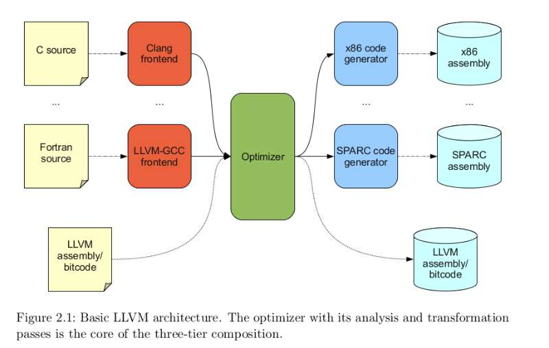

# 编译系统实现
本次作业中, 编译系统主要参考了 Cpu0 项目的[编译器后端](http://jonathan2251.github.io/lbd/),
[链接器](http://jonathan2251.github.io/lbt/). 编译系统基于 llvm 框架.

LLVM 是一个以 "可拓展性"，"模块化" 为目标的编译系统框架， 包括编译器, 汇编器，binutils 工具如链接器和objdump，以及内部的一些工具。我们主要使用了其中的编译器，汇编器和链接器。
LLVM 编译器框架是三段式的，每种高级语言对应一个前端，负责解析高级语言，生成类似三地址码的 IR；中间负责 IR 的优化；每种 ISA (x86, ARM...)对应一个后端，负责从 IR 生成机器指令。
LLVM的整体组成框架如下图



# 编译过程简述
llvm 中, 编译过程分三段:
1. clang 前端解析 C 代码 (或者其他语言), 将其转换成一种中间表示 IR.
IR 就类似 AST / 三地址码, 和具体的机器 ISA 无关. 一个 IR 的例子如下
~~~ llvm
define i32 @add2(i32 %a, i32 %b) {
entry:
  %tmp1 = icmp eq i32 %a, 0br i1 %tmp1, label %done, label %recurse
recurse:
  %tmp2 = sub i32 %a, 1
  %tmp3 = add i32 %b, 1
  %tmp4 = call i32 @add2(i32 %tmp2, i32 %tmp3)
  ret i32 %tmp4
done:
  ret i32 %b
}
~~~
2. 存在一个针对中间代码的通用优化器, 优化中间代码.
3. llvm 后端 `llc` 将中间代码转换成最终的汇编代码, 或者等价地二进制目标文件.

本项目中编译器的工作基本就在第三部分.
接下来叙述一下第三部分进一步的流程.

从 IR 转换成最终的目标代码, 需要完成如下的步骤
1. Instruction Selection (ISel) 指令选择: 使用目标 ISA 的指令来完成 IR 中的操作,
如对于 IR 中的 `add`, 我们可以选择 `add` 和 `addiu`.
2. Pre-RA Instruction Scheduling 指令调度: 将指令排序, 减少依赖和冲突造成的停顿. 我们没有使用.
之后的描述里面也不涉及这部分相关的内容.
3. Register Allocation (RA) 寄存器分配: 直到这一步, 寄存器都是虚拟寄存器.
这一步使用寄存器分配算法, 对每个虚拟寄存器都对应一个目标 ISA 的物理寄存器.
这一部分我们直接使用 LLVM 自己的算法即可. 之后的描述里面也不提这部分相关的东西.
4. Post-RA Instruction Scheduling 指令调度: 同上, 但是考虑物理寄存器的依赖和冲突. 我们不使用.
之后的描述里面也不涉及这部分相关的内容.
5. 优化: 不使用.
6. 代码发射: 把上面得到的结果用文本形式或者二进制目标文件形式打印出来.

## 指令选择
LLVM 使用的是一种类似 Tree Rewriting (参见龙书 Instruction Selection by Tree Rewriting) 的指令选择模式,
对于每个基本块他在生成的 DAG 上做重写而已.

### 基本块和流分析
编译课讲过.

### Rewriting 算法
为了简便下面叙述 Rewriting 算法在树上的情况, DAG 类似.
简单的说, 就是每条指令对应一个树上的重写模式, 如 `add r1, r2, r3` 可以把子树
```
        +
       / \
      /   \
     v     v
    r2     r3
```
替换成单个节点
```
        r1
```
同时发射一条指令 `add r1 r2 r3`.

对于每个基本块, 做完数据流分析之后我们得到一颗树 (编译课上讲是 DAG, 不过是等价的),
按照这样的替换规则, 寻找这颗树中能替换的部分, 将其替换并且发射指令
直到没有能替换的部分, 我们就可以宣告成功或者失败 (如没有 `add` 类的指令但是树中有 `+` 结点).

### LLVM 的 DAG 相关的模型
中间代码产生的 IR 还不能直接应用到我们的指令选择, 因为
* IR 使用的是虚拟寄存器
* IR 中有大量高层操作, 如依赖于 ABI 的 `call`, `ret`, 抽象的 "加" 在底层对应寄存器寄存器加, 寄存器立即数加等.

所以 DAG 还要经历所谓的 Lowering. 包括
* 操作本身: 将高层次的操作变得更低层次, 如把 IR 的 `call` 变成加载目标地址和 `jalr`
* 操作数: 目标架构支持的数据类型有限, 如 1 位的 bool 需要被拓展到 32 位.

# 使用 tablegen 描述目标架构
LLVM 的设计非常好, 只需要在称为 tablegen 的一种 DSL 中描述目标 ISA,
之后就只用写 "一点" C++ 代码就能完成上述步骤. (还是需要几千行)

DSL 描述 ISA (称为一个 Target) 我们需要描述的有

* 寄存器结构:
  - 有多少寄存器
  - 每个是什么名字
  - 有那些寄存器类别
  - 其他包括 dwarf 调试信息等

* 指令信息:
  - 指令有哪几种编码, 都是什么样的
  - 指令的操作数描述, 如 16 位立即数, 如 `imm($ra)`
  - 每条指令的功能: 他的操作对应 IR 中那个操作 (如 `add` 和 `addiu` 对应 IR 中的 `add`)
  - 每条指令的编码
  - 每条指令的额外信息, 如是否是跳转, 有那些输入的操作数, 输出又是那些操作数
  - ISel 中使用的 DAG 模式 (后文细述)

* Calling Conventions 调用约定:
  - 那些寄存器是 caller save? 那些是 callee save
  - 参数和返回值是放到寄存器里还是栈上, 分别又是放到哪里

之后对于每个 Subtarget (同一个 Target, 但是有不同的变种如 Mips16, Mips32) 把信息综合起来到一个 tablegen 里面.

# 工作步骤
构建一个 llvm 后端, 需要使用 tablegen 和 C++ 共同描述目标 ISA.

LLVM 为了模块化, 大量使用了 OO 的设计,
新建后端的 tablegen 和 C++ 代码都需要继承 LLVM 已有的类,
改写域 / 实现虚函数.

1. **注册**: 在 llvm 框架中注册后端.
  - 相关文件: `LLVM/lib/` 中除了 `LLVM/lib/Target/XXX` 的新增代码, 其中 `XXX` 是我们的架构名字.

2. **描述ISA**: 
  - 相关文件: (`XXX/` 表示 `LLVM/lib/Target/XXX`, 在我们的项目中 `XXX` 就是 Cpu0)
  `XXX/XXXRegisterInfo.td`, `XXX/XXXInstrInfo.td`, `XXX/XXXInstrInfo.td`, `XXX/CallingConv.td`,
  `XXX/XXX.td`, `XXX/XXXInstrInfo.{cpp,h}`, `XXX/XXXRegisterInfo.{cpp,h}`

3. **C++ 描述 TargetMachine**: 描述目标架构, 如数据布局
  - 相关文件: `XXX/XXX.h`, `XXX/XXXTargetMachine.{cpp,h}`, `XXX/XXXSubtarget.{cpp,h}`,
    `XXX/TargetInfo/XXXTargetInfo.cpp`

4. **C++ 描述复杂的 DAG 控制**: 诸如传参, 函数调用, 函数返回值等操作, 需要复杂的对 LLVM 指令选择 DAG 的操作.
  - 栈布局: `XXX/XXXFrameLowering.{cpp,h}`
  - 复杂 Lowering: `XXX/XXXISelDAGToDAG.{cpp,h}`, `XXX/XXXISelLowering.{cpp,h}`

5. **打印汇编代码**
  - 相关代码: `XXX/XXXMCInstLower.{cpp,h}`, `XXX/XXXAsmPrinter.cpp`, `XXX/InstPrinter/XXXInstPrinter.{cpp,h}`

6. **机器代码发射**
  - 相关代码: `XXX/MCTargetDesc/*`

因为时间有限, 本项目中主要的精力放在 tablegen 上, 后面有一些 C++ 代码没有仔细理解.

# 注册
1. 加入新的 ELF `e_machine`, 在 `LLVM/lib/Object/ELF.cpp`
2. 修改 `LLVM/lib/Support/Triple.cpp`, 加入 XXX 的 triple.

# 描述 ISA
## tablegen 部分
我们 tablegen 主要依赖的有 
`LLVM/include/llvm/Target/Target.td`,
`LLVM/include/llvm/Target/TargetSelectionDAG.td`,
`LLVM/include/llvm/Target/TargetCallingConv.td`
代码. 步骤如下.

1. 加入寄存器描述 `XXX/XXXRegisterInfo.td`. 在我们的代码中, 包括

2. 加入指令描述. `XXX/XXXInstrInfo.td`. 这一过程大量使用 tablegen 的继承特性, 来避免重复的工作.
  - 指令格式: 指令长度, 二进制编码是什么样的, 如 `FA` 是 
```
class FA<bits<6> opcode, dag outs, dag ins, string asmstr, list<dag> pattern>:
      Cpu0Inst<outs, ins, asmstr, pattern, Cpu0IEF_A>
{
  bits<5>  ra;
  bits<5>  rb;
  bits<5>  rc;
  bits<11> reserved = 0;

  let Inst{31-26} = opcode;
  let Inst{25-21} = ra;
  let Inst{20-16} = rb;
  let Inst{15-11} = rc;
  let Inst{10-0} = reserved;
}
```
  - 具体指令操作: 对于每个指令, 需要描述其操作码, 汇编语言怎么表示,
    输入操作数有哪些, 输出操作数有哪些, 这条指令完成什么样的功能 (通过一个 DAG 碎片描述)
  - 新的 `SDNode`: 指令选择 DAG 中, 除了 LLVM 自带的如 `add` 等结点, 还允许后端自己定义 DAG 结点.
    我们这里主要定义了针对 XXX 的函数调用和返回定义新的 SDNode.
    为了定义 `SDNode` 可能还需要加入 `SDTypeProfile`, 用于描述 DAG 结点的输入应当是什么类型.
  - 定义操作数类型: 如 16位有符号数, 16位无符号数, 内存操作数 `off($rx)`
  - DAG 中模式替换: 比如使用 `xor` 替换 `not`: `def : Pat<(not CPURegs:$in), (XOR CPURegs:$in, (ADDiu ZR, -1))>;`
  - 结点变换: 修改已有的 DAG 结点, 如取立即数的高 16 位.
  - 指令别名

3. 描述调用约定. `XXX/XXXCallingConv.td`. 我们这里只是约定传参和返回值的寄存器, 以及被调用者保存的寄存器.

4. 将以上组合到一起, 形成一个具体的 (sub)target. 在我们具体的项目中, 是 `Cpu0Other.td`.

## C++ 部分
主要是 `XXXInstrInfo.{cpp,h}` 和 `XXXRegisterInfo.{cpp,h}`.

* `XXXRegisterInfo`: 指定保留寄存器 (一般的 C 语句翻译后不应当使用, 如 `$sp`, `$pc`), 指定翻译栈上地址的方式 (`off($sp)`)

* `XXXInstrInfo`: 提供简单的物理指令生成, 如 `expandPostRAPseudo` (寄存器分配后的伪指令展开), `adjustStackPtr` (发射函数入口时调整 `$sp` 的指令)

# 描述 TargetMachine
基本复制粘贴其他 ISA 的 TargetMachine

# 复杂的 DAG 控制
## 栈布局控制
`XXXFrameLowering.{cpp,h}` 中实现如下函数
* `emitPrologue`: 发射进入函数时需要执行的代码, 如调整 `$sp`
* `emitEpilogue`: 发射离开函数时执行的代码
* `spillCalleeSavedRegisters`: 发射用于保存 callee-saved 寄存器的代码.
* `determineCalleeSaves`: 确定那些寄存器要被保存. 被修改的 callee-saved 寄存器需要被保存 (包括 `jalr` 等对 `$lr` 的修改)

## 复杂 Lowering
这一部分还在继续研究.
这一部分包括函数调用, 返回等. 因为函数调用传参可能包括可变参数, 以及用完传参寄存器后用栈传参等情况.

# 打印汇编代码
* `XXXMCInstLower`: 将 `MachineInstr` 变成可以发射的 `MCInst`
* `XXXAsmPrinter`: 把机器指令转换成字符串之后输出到输出流中
* `InstPrinter/XXXInstPrinter`: 提供操作数如何用字符欢表示,
  再由 tablegen 整合 ISA 描述部分的汇编表示, 完成指令转换成字符串

# 机器代码发射
* `MCTargetDesc/XXXAsmBAckend`: 提供汇编语言中需要的 fixup (类似重定位)
* `MCTargetDesc/XXXMCAsmInfo`: 我们项目中, 汇编信息就是各种 linker / loader 指令的字符串表示
* `MCTargetDesc/XXXMCCodeEmitter`: 类似上面的 AsmPrinter, 只不过生成的是二进制 .o 结果而非汇编结果.
  因此, 还需要加入重定位的内容 (reloc 和 symbols).
* `MCTargetDesc/XXXMCExpr`: 机器代码中也可能有表达式, 如 `addiu $t0, $t0, 100-50`,
  或者 `lui $t0, %hi(symb); ori $t0, $t0, %lo(symb)` (加载 `symb` 的地址到 `$t0` 中)
* `MCTargetDesc/XXXMCTargetDesc`: 提供创建描述代码生成的关键类的函数声明, 如 `createXXXMCCodeEmitter() -> MCCodeEmitter` 等

# 汇编器
汇编器主要相关的文件是 `XXX/AsmParser/XXXAsmParser.cpp`.
其中就是一个简单的汇编语言的前端.

# 链接器
链接器接受输入是若干可链接的目标文件 (通常是 .o 文件),
输出是将这些目标文件打包变成可执行文件 (a.out 文件) 等格式.
为了简单其间, 以下只叙述把 .o 链接变成 a.out 可执行文件的情况.

链接器的工作分为两部分
* 扫描得到输入文件中所有符号 (包括函数, 变量), 确定每个符号在最终可执行文件
* 对于引用这些符号的汇编指令 (如 `lui $t0, %hi(extern_var)`), 用确定之后的符号地址改写这些汇编指令 (如确定之前 `lui` 的立即数)

## 链接器的实现
容易看出来, 链接器的工作和 ISA 关系不大.
主要有关系的就是重定位类型 (relocation type),
虽然 ISA 会间接决定重定位类型有哪些.

在我们现在这个简单的版本中, 事实上我们只需要
* `R_CPU0_32`: 包含目标符号地址整个 32 位的重定位
* `R_CPU0_HI16`, `R_CPU_LO16`: 包含目标符号地址整个 32 位的重定位
* `R_CPU0_PC16`, `R_CPU0_PC24`: 相对当前 PC 的 16 和 26 (`PC24` 是打错了) 位范围内的跳转

因此链接器我们直接使用 Cpu0 的链接器就行了.
但是 Cpu0 中照抄 Mips 出现了 bug,
在对于 HI16 这种重定位类型时, 它取 `V` 的高十六位是 `(V+0x8000)>>16`,
但是在我们的 ISA 中取 `V>>16` 即可, 就是不用考虑第 15 位.

# 参考文献
* [Getting Started with LLVM Core Libraries](https://e.jd.com/30370568.html), 百度也能找到电子书
* Cpu0 两篇文档: [lbd](http://jonathan2251.github.io/lbd/) [lbt](http://jonathan2251.github.io/lbt/)
* [Building an LLVM Backend - LLVM 2014 tutorial](http://llvm.org/devmtg/2014-10/Slides/Cormack-BuildingAnLLVMBackend.pdf)
* [Howto: Implementing LLVM Integrated Assembler - A Simple Guide](https://www.embecosm.com/appnotes/ean10/ean10-howto-llvmas-1.0.pdf)
