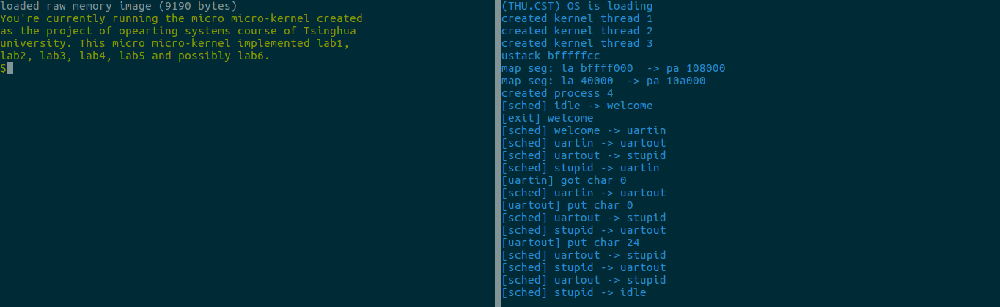

# 轻量OS在“小脚丫”FPGA开发板上的实现

计53班 张天扬， 王延森，戴臻旸

------------------------------------------------------------------------------
# 引言

目前使用的FPGA开发板价格都比较昂贵，其元件也较为复杂；以Linux为代表的开源操作系统都致力于使操作系统尽可能功能完善，但也使得其越来越复杂。这些因素为本科生教学工作中计算机组成原理和操作系统的实验带来了较大的困难。

在前期调研中，我们发现“小脚丫”公司开发的STEP系列是为初学者打造的一个FPGA入门平台，提供了一套极其精简的可编程逻辑器件平台，为FPGA初学者提供了物美价廉的学习环境。同时，recc是一个由国外团队RobertElder开发的极其精简的教学用操作系统，实现了操作系统的基本框架以理解基本原理。

在本项目中，我们将二者结合，实现一整套尽可能精简的“CPU+OS+Compiler”实验平台，用于今后可能的教学研究工作。 

------------------------------------------------------------------------------
# 项目贡献

- 修改、设计了整套指令系统，由19条指令组成。
- 完成了针对该指令系统的CPU模拟与实现。
- 实现了针对该套指令系统的C代码编译器。
- 提供了使用该指令系统的极小型操作系统，并在模拟和实际环境中测试完成。

------------------------------------------------------------------------------
# 构建指南
## 环境要求
* cmake：3.5.1
* clang：3.9.0
* make：4.1
* GNU binutils：2.26.1
## 一键构建运行
~~~ sh
$ ./setup
~~~

------------------------------------------------------------------------------
# 各部分文档

| 组成部分 | 文档文件 |
| --- | --- |
| 指令集 | isa.md |
| 硬件 | cpu.md |
| 编译系统 | llvm.md |
| 模拟器 | emulator.md |
| recc 操作系统 | os.md |
| 改进的操作系统 | osnew.md |

------------------------------------------------------------------------------
# 成员分工

- 张天扬：对项目负责。负责报告、综合测试、OS修改及一部分硬件调试。
- 王延森：负责硬件实现及调试。
- 戴臻旸：主要负责编译器实现、模拟器实现，以及OS对修改后指令系统的移植。在项目早期也参与了一部分硬件实现的工作。

------------------------------------------------------------------------------
# 参考文献
* [Getting Started with LLVM Core Libraries](https://e.jd.com/30370568.html), 百度也能找到电子书
* Cpu0 两篇文档: [lbd](http://jonathan2251.github.io/lbd/) [lbt](http://jonathan2251.github.io/lbt/)
* [Building an LLVM Backend - LLVM 2014 tutorial](http://llvm.org/devmtg/2014-10/Slides/Cormack-BuildingAnLLVMBackend.pdf)
* [Howto: Implementing LLVM Integrated Assembler - A Simple Guide](https://www.embecosm.com/appnotes/ean10/ean10-howto-llvmas-1.0.pdf)
* STEP-CYC10 硬件手册 V0.1
* STEP-CYC10 软件手册 V0.1
* [RECC, The Robert Elder Compiler (and emulator and microkernel) Collection](http://recc.robertelder.org/)
